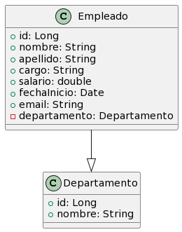

# 

# Desarrollo de una Aplicación de Gestión de Empleados

Este proyecto tiene como objetivo la creación de un backend lógico para una aplicación de gestión de empleados de una empresa. La aplicación permitirá a los usuarios realizar diversas operaciones CRUD (Crear, Leer, Actualizar y Borrar) utilizando JPA (Java Persistence API) para interactuar con una base de datos.

## Contenido del README

1. [Introducción](#introducción)
2. [Operaciones CRUD](#operaciones-crud)
    - [Agregar un nuevo empleado](#agregar-un-nuevo-empleado)
    - [Listar empleados](#listar-empleados)
    - [Actualizar información de un empleado](#actualizar-información-de-un-empleado)
    - [Eliminar un empleado](#eliminar-un-empleado)
    - [Buscar empleados por cargo](#buscar-empleados-por-cargo)
3. [Requisitos Técnicos](#requisitos-técnicos)
4. [Estructura del Proyecto](#estructura-del-proyecto)
5. [Manejo de Excepciones (EXTRA)](#manejo-de-excepciones-extra)
6. [Relación con el Departamento](#relación-con-el-departamento)
7. [Supuestos](#Supuestos)

## Introducción

La aplicación se centra en la gestión de empleados, permitiendo a los usuarios realizar operaciones esenciales como agregar, listar, actualizar y eliminar empleados. Además, ofrece la posibilidad de buscar empleados por su cargo.

## Operaciones CRUD

### Agregar un nuevo empleado

Los usuarios podrán ingresar información sobre un nuevo empleado, incluyendo nombre, apellido, cargo, salario ,email y fecha de inicio. Para garantizar la validez de los datos, se aplicarán validaciones, como asegurarse de que los campos obligatorios no estén vacíos.

### Listar empleados

La aplicación proporciona la funcionalidad para visualizar la lista de todos los empleados almacenados en la base de datos.

### Actualizar información de un empleado

Los usuarios pueden modificar la información de un empleado existente, incluyendo nombre, apellido, cargo, salario, email o fecha de inicio.

### Eliminar un empleado

La aplicación permite a los usuarios eliminar un empleado de la base de datos. Se ha implementado un borrado logico

### Buscar empleados por cargo

Los usuarios tienen la capacidad de buscar empleados por su cargo y visualizar una lista de los empleados que tienen ese cargo.

## Requisitos Técnicos

- Lenguaje de Programación: Java
- Persistencia: Java Persistence API (JPA)
- Validación de Datos: Utilización de estructuras de control para validar datos de entrada, asegurando que los campos obligatorios no estén vacíos y que los valores como salario, email o fecha sean válidos.
- Gestión de Datos: Utilización de colecciones para gestionar los datos antes de interactuar con la base de datos.

## Estructura del Proyecto

employee-management-app/
|-- src/
| |-- main/
| |-- java/
| |-- com/
| |-- development/
| |-- employeecrud/
| |-- logica/
| |-- Empleado.java
| |-- Departamento.java 
| |-- Controlador.java

| |-- persistencia/
| |-- ControladoraPersistencia.java

| |-- controller/
| |-- EmpleadoDAO.java
| |-- Validaciones.java

| |-- Exceptions/
| |-- EntradaInvalidaException.java
| |-- FechaInvalidaException.java

| |-- igu/
| |-- GestionEmpleados.java

|-- target/
|-- pom.xml
|-- README.md

## Manejo de Excepciones (EXTRA)

a aplicación emplea dos clases de excepciones personalizadas: 
EntradaInvalidaException y FechaInvalidaException, 
ambas se implementaran en la clase de Validaciones, para validar que no se crean empleados con datos vacios en la base de 
datos y para validar que la fecha tenga un formato correcto 

## Relación con el Departamento

La aplicación también implementa una relación con el 
departamento al cual pertenece cada empleado. Cada empleado 
tiene una referencia al departamento correspondiente. 
Para ello se ha creado una nueva clase: Departamento, 
y la actualización de la clase Empleado para incluir una relación con Departamento.
Se ha creado esta relación mediante la anotación @ManyToOne 
para indicar que cada empleado (Many) puede pertenecer a un solo departamento (One).

# 

## Supuestos 

1. Se asume que el usuario conoce el ID del empleado al realizar operaciones de actualización y eliminación.
2. Se asume que el formato de fecha introducido por el usuario sigue el estándar "yyyy-MM-dd".
2. Se espera que las fechas proporcionadas estén en el rango válido y no sean futuras con respecto a la fecha actual.
4. Se supone que los correos electrónicos ingresados cumplen con un formato básico (contienen al menos un '@' y un '.').

